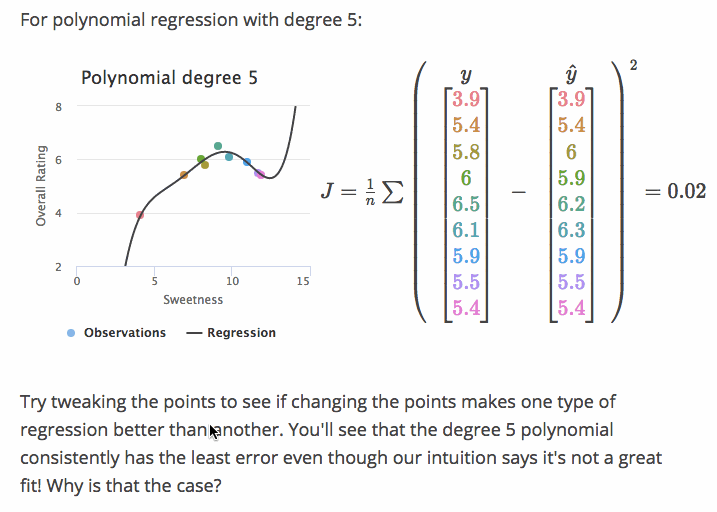
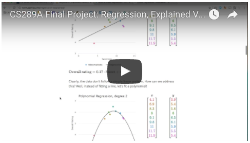

Regression, Explained Visually
=====================

This little web application explains the concept of regression as used in
machine learning. It uses interaction and animation to help the learner develop
an intuition for linear regression, polynomial regression, and
cross-validation.

Here's the intro video for project:

This web app was created as a final project for Berkeley's Machine Learning
class, [CS289A][289].

[289]: https://people.eecs.berkeley.edu/~jrs/189/
